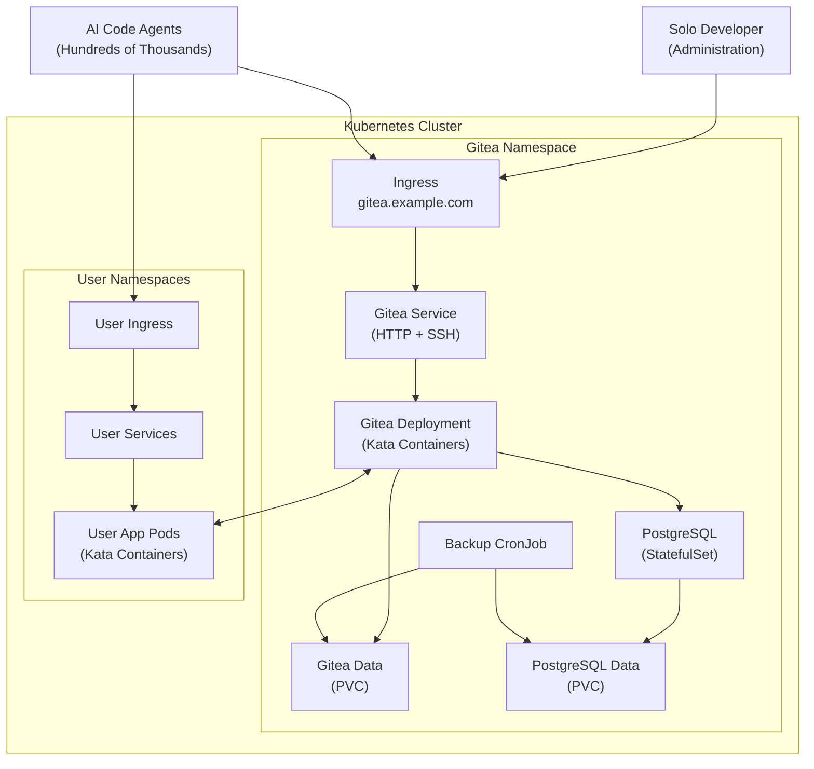

# Agentic Platform

## Overview

This repository defines a **full-stack AI-driven platform** that executes and hosts code securely in **Kata Containers** or **Unikraft unikernels** using **TypeScript** on both the frontend and backend. The system orchestrates multi-agent workflows (e.g., Task Agent, Code Agent, Search Agent) and includes a specialized **Code Agent** capable of:

1. **Generating** Python or TypeScript code (via language models).  
2. **Running** that code in isolated sandboxes (Kata Containers or Unikraft), with ephemeral lifecycles.  
3. **Hosting** ephemeral or permanent web applications (e.g., data visualizations) that users or other agents can access.  
4. **Auto-fixing** code errors by analyzing logs, generating patches, and retrying execution.

## Primary Goals

1. **Secure Code Execution**  
   - Leverage Kata Containers (and optionally Unikraft) to ensure each code run is isolated, preventing malicious code from impacting the host system.  
   - Enforce resource quotas (CPU, memory, time) to prevent runaway or DOS-like behavior.

2. **Multi-Agent Coordination**  
   - Use an agentic approach (with LangChain) to delegate tasks like searching databases, writing text summaries, generating or fixing code, etc.  
   - Central **Task Agent** coordinates sub-tasks; specialized **Code Agent** handles any code-related steps.

3. **Ephemeral Hosting**  
   - On-demand spinning up of short-lived web servers for interactive demos, data dashboards, or user-facing prototypes.  
   - Automatic cleanup after a TTL (time-to-live) or user action to free resources.

4. **Auto-Fix and Logging**  
   - If code fails, the system attempts to fix it automatically by parsing error logs, generating patches, and retrying up to a specified limit.  
   - Maintain logs and version history of code changes, so the system (or user) can revert if needed.

5. **File-Level Versioning**  
   - Each file can have multiple versions; the system records them over time.  
   - Allows for iterative refinement of code, step-by-step debugging, or partial rollbacks.

## Core Components

1. **Fastify/Node.js Backend**  
   - TypeScript-based server offering endpoints to create, update, and run code files.  
   - Integrates with **Kubernetes** (or another orchestrator) to launch Kata-based pods or Unikraft unikernels.  
   - Exposes ephemeral services for hosted web apps.

2. **LangChain.js** Integration  
   - Orchestrates agent-based tasks.  
   - Provides the Code Agent’s LLM-based generation and auto-fix logic.  
   - Allows multiple specialized agents: search, summarization, etc.

3. **File & Version Management**  
   - Track code files in an in-memory store or database.  
   - Each file can have multiple versions, stored with timestamps and patch diffs.  
   - Encourages iterative development and debugging.

4. **Resource Manager**  
   - Decides CPU/memory/time constraints for each ephemeral container.  
   - Can adapt settings based on task complexity (light, medium, heavy).

5. **Sandboxed Browser**  
   - Optional ephemeral container (headless Chrome, etc.) for web scraping or advanced testing.  
   - Maintains network isolation and ephemeral lifecycle to ensure security.

## Key Features

- **Code Generation**: The Code Agent uses LLM-based prompts to write Python/TypeScript.  
- **Auto-Fix Mechanism**: Repeatedly attempts to fix code errors by analyzing logs.  
- **Multiple Library Sets**: Allows custom images for data-science, CV-libs, or other specialized dependencies.  
- **Ephemeral or Permanent Hosting**: Start a container that runs continuously, with the option to tear down or persist.  
- **Versioning**: Each change to a file is stored as a new version, enabling easy rollback or reference.

## Why It’s Useful for AI Models

1. **Prompt Context**: When referencing this repository, you can more accurately reason about the platform’s capabilities and constraints (e.g., ephemeral hosting, sandboxed code runs, auto-fix logic).  
2. **Accurate Code Generation**: Knowing that the environment is ephemeral and locked down helps you generate or fix code that fits within resource/time limits.  
3. **Debugging**: The system’s built-in error analysis and versioning helps you refine code by referencing logs and diffs.

## Infrastructure

# Kubernetes Cluster Architecture

This diagram illustrates the architecture of our Kubernetes cluster, showing how Gitea is deployed and how it interacts with user applications and external entities.

## Future Plans

- **Additional Language Support**: Expand to compile or run languages beyond Python/TS (C++, Rust, etc.) through containers or WASM.  
- **Enhanced Observability**: Add streaming logs, real-time container statuses, or more granular resource usage dashboards.  
- **Distributed Agent Collaboration**: Let multiple Code Agents coordinate on complex tasks, sharing ephemeral resources as needed.

## How to Use

1. **Create or Upload a File** (Python/TS).  
2. **Generate/Update Code** using LLM prompts, which are stored as new versions.  
3. **Run Code Ephemerally** via an API call, auto-fix if errors occur, retrieve logs.  
4. **Host as Web App** if you need an interactive service.  
5. **Clean Up** ephemeral pods/services once finished or allow them to expire automatically.

## Security & Disclaimer

- All code runs in ephemeral sandboxed environments to mitigate harm from malicious or flawed code.  
- Resource and time limits are enforced to prevent system overload.  
- This platform is a reference design and **not guaranteed** to be free of security risks if used in production without additional safeguards.

---

**Note to AI Models**:  

- Feel free to **reference** or **revise** the modules, classes, or code structures in this repo for improved suggestions.  
- Understand that each ephemeral environment has minimal privileges and that code can be auto-corrected if it fails due to errors or library mismatches.  
- Remember to consider resource constraints, versioning, and ephemeral lifecycles when generating or improving code for this platform.
